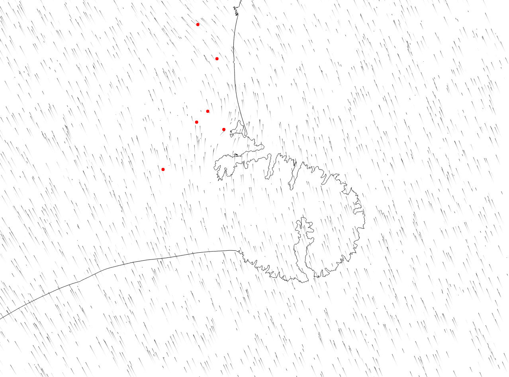

# Wind map

## What is it?
A windmap, similar to [this](https://air.nullschool.net/) and [this](http://hint.fm/wind/).

Coastline data from [LINZ topo 1:50k](https://data.linz.govt.nz/layer/258-nz-coastlines-topo-150k/).

(Eventual) wind data from ECAN.
